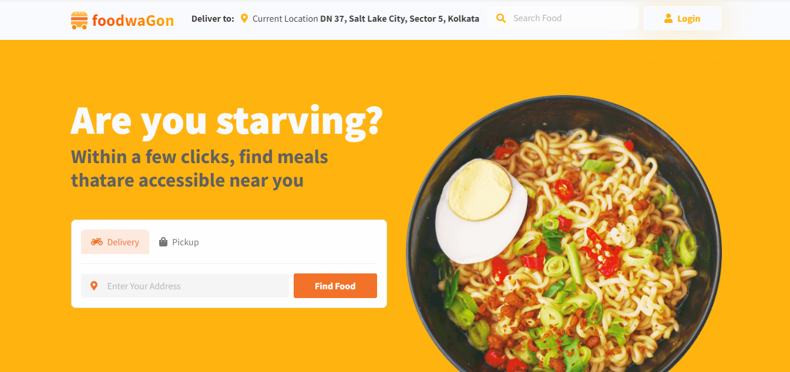
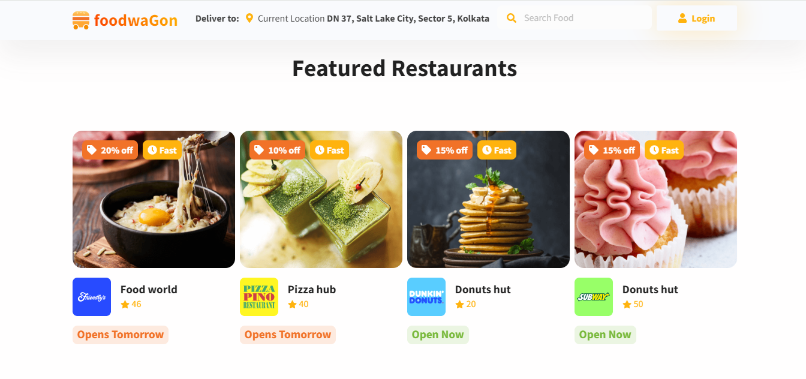

# Foodwagon
Foodwagon is a responsive e-commerce and business template designed for food delivery services. It provides a modern and user-friendly interface to help customers easily find and order food from local restaurants.

# Screenshots
1. 
2. 

# Features
⌀ Responsive Design: Compatible with all devices (desktop, tablet, mobile).
⌀ User Authentication: Secure login and registration system.
⌀ Search Functionality: Easily search for food items or restaurants.
⌀ Order Management: Seamlessly place and manage orders.
⌀ Discounts and Offers: Display current discounts and offers on food items.
⌀ Payment Integration: Multiple payment methods for quick and secure transactions.

# Installation
1. Clone the repository:
git clone https://github.com/yourusername/foodwagon.git

2. Navigate to the project directory:
cd foodwagon

3. Install the dependencies:
npm install

# Usage
1. Start the development server:
npm start

2. Open your browser and visit http://localhost:3000 to see the template in action.

# Project Structure
index.html: The main HTML file for the template.
assets/: Contains images, stylesheets, and other static assets.
css/: Stylesheets for the project.
js/: JavaScript files for the project.

# Contributing
We welcome contributions to improve Foodwagon. To contribute:

1. Fork the repository.
2. Create a new branch:
    git checkout -b feature/your-feature-name
3. Make your changes and commit them:
    git commit -m "Add your feature"
4. Push to the branch:
    git push origin feature/your-feature-name
5. Open a pull request and describe your changes.

# License
This project is licensed under the MIT License. See the LICENSE file for details.

# Contact
For any questions or suggestions, please open an issue or contact us at (https://github.com/abhisekumarjha/).
